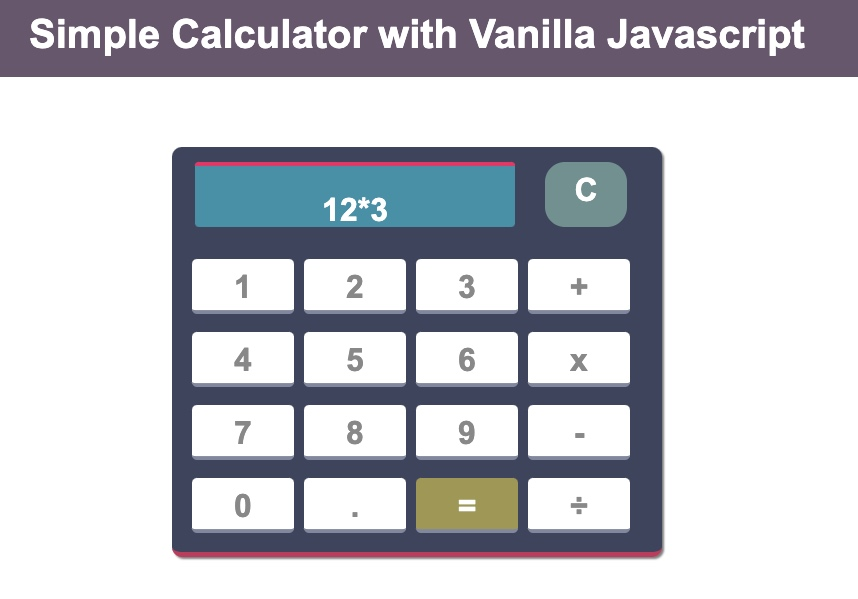

# Calculator-with-JavaScript-and-CSS

This is a simple Calculator application built with HTML, CSS and Vanilla Javascript.

Project Status

This project is complete with the basic calculator functionalities. Users can perform basic calculations such as addition, subtraction, division and multiplication and use the 'C' or clear button to clear the screen.

Project Screen Shot(s)

Setup Instructions
Clone down this repository.
open the folder in your IDE.
Install Live server if you are on VS Code.
Navigate to the index.html file and open with live server.
You can also open the Index.html file directly with your browser.

Reflection

In this project, I built a simple calculator application with javascript and styled the UI with CSS. The simple calculator application implements basic javascript functions like the eval that computes or evaluates the string expression inputed.
